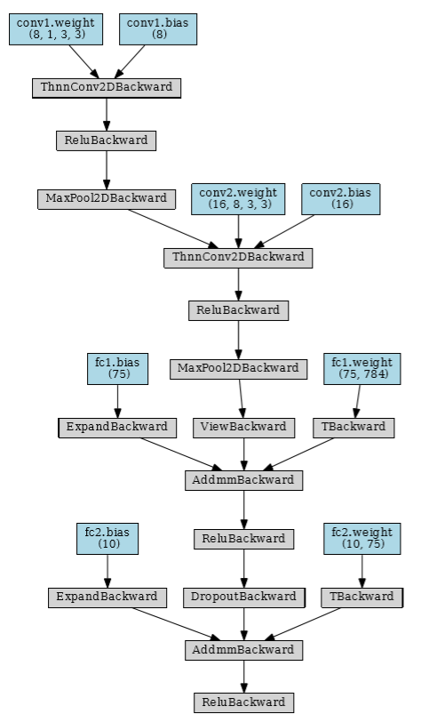

# Simple-CNN-classifier-for-FashionMNIST-in-Pytorch
simple CNN achieving 90% accuracy on FashionMNIST dataset

## Description
This notebook is part of UDACITY's Computer Vision Nanodegree.
The objective is to achieve the highest accuracy on the FashionMNIST dataset with a simple Convolutional Neural Network.

FashionMNIST is a well-known toy dataset made of 10 classes and 60k 28x28 grayscale images for training and 10k images for testing.

## CNN Network summary
I used 2 convolutional layers and 2 fully connected layers. The first Conv outputs 8 feature maps of 14x14, the second 16 of 7x7. This volume is flatten in a vector of size 784 before the fully connected section.
- the 2 Convolutional blocks are sequenced with CONV, ReLu activation, Maxpooling layers.
- the 2 fully connected layers are sequenced with Linear, ReLu. A dropout step (0.2) is inserted between the two FC layers (784 nodes -> 75 -> 10 for classification).
- I did not include a softmax function in the network since this is combined in Pytorch with the `nn.CrossEntropyLoss()` loss function function.

note: PytorchViz vizualization tool available [here](https://github.com/szagoruyko/pytorchviz)

I used SGD optimizer with momentum to avoid local minimum. learning rate was 0.001 and batch_size 50.
I trained for 25 epochs reaching just below 90% accuracy. with 50 epochs i reached 90%. Training further continued to decrease the training loss but the accuracy on unseen images (test set) remained at 90% which is a sign of overfitting.

## Results

